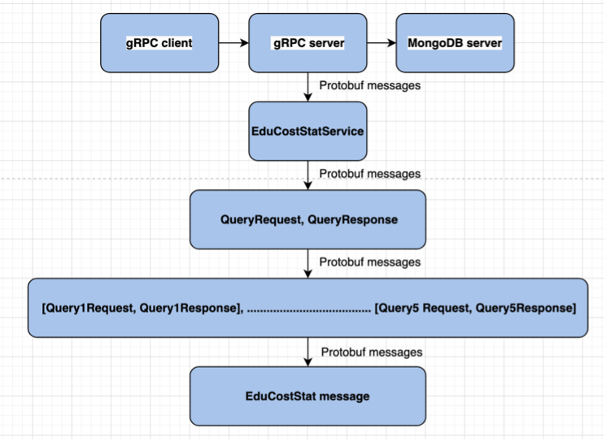

# gRPC-Gradle-MongoDB

[Abishek Arumugam Thiruselvi](https://www.abishekarumugam.com)('40218896')
[Srinidhi Honakre Srinivas]

# Running the Application in Eclipse
#### Prerequisites: Eclipse IDE plugins Buildship Gradle Integration 3.0, Spring Tools 3, Git, Java 17 or greater, Maven 3.9 or higher and Gradle 7.6 or higher.

1. Open Git Perspective in IntelliJ IDEA and clone this [repository]([https://github.com/abishekat/dss-assignment-2](https://github.com/abishekat/dss-assignment-2))

2. Import the project into project explorer using git url.

3. Open the gradle tab 

   ```shell
   dss-assignment-2 -> generateProto
   ```

4. Run spring application and create and run client with arguments

5. To run the application on terminal 

   ```shell
   gradle build
   gradle run
   ```
## RESULTS

#### Structure


#### Higher Layer Architecture


#### Queriying and saving the result in new collections


### UNIVERSITY

 [CONCORDIA UNIVERSITY](https://www.concordia.ca/).
  
